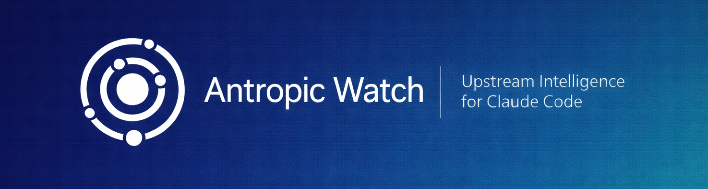

<div align="center">



[](https://github.com/sefaertunc/anthropic-watch/releases)
[](https://github.com/sefaertunc/anthropic-watch/actions)
[](https://github.com/sefaertunc/anthropic-watch/blob/main/src/sources.js)
[](https://sefaertunc.github.io/anthropic-watch/feeds/all.xml)
[](https://github.com/sefaertunc/anthropic-watch/blob/main/LICENSE)
[](https://github.com/anthropics/claude-code)

[](https://github.com/sponsors/sefaertunc)
&nbsp;
[](https://buymeacoffee.com/sefaertunc)

[Dashboard](https://sefaertunc.github.io/anthropic-watch/) ·
[RSS Feed](https://sefaertunc.github.io/anthropic-watch/feeds/all.xml) ·
[JSON Feed](https://sefaertunc.github.io/anthropic-watch/feeds/all.json) ·
[Sources](docs/SOURCES.md) ·
[Feed Schema](docs/FEED-SCHEMA.md) ·
[Documentation](docs/ARCHITECTURE.md)

</div>

Monitors Anthropic sources daily for changes and publishes structured feeds — so you never miss a Claude Code update.

## What is this?

anthropic-watch scrapes Anthropic blogs, changelogs, GitHub releases, npm packages, documentation, the status page, and community signal (Reddit, Hacker News, curated Twitter) daily. It detects new content by comparing against persisted state, accumulates items into RSS and JSON feeds, and deploys everything to a static dashboard on GitHub Pages. No server needed — just subscribe via RSS or fetch the JSON feeds.

## For consumers

Applications consuming the feeds programmatically should use the official client library:

```bash
npm install @sefaertunc/anthropic-watch-client
```

The library handles version gating, composite-key deduplication, and typed errors. See [`packages/client/`](packages/client) for the full API. The hand-rolled consumption pattern is also documented in [`docs/FEED-SCHEMA.md`](docs/FEED-SCHEMA.md) for non-JS consumers.

## Subscribe to feeds

| Format             | URL                                                                                     |
| ------------------ | --------------------------------------------------------------------------------------- |
| RSS (all sources)  | [`feeds/all.xml`](https://sefaertunc.github.io/anthropic-watch/feeds/all.xml)           |
| JSON (all sources) | [`feeds/all.json`](https://sefaertunc.github.io/anthropic-watch/feeds/all.json)         |
| OPML (import all)  | [`feeds/sources.opml`](https://sefaertunc.github.io/anthropic-watch/feeds/sources.opml) |

Every source has its own JSON and RSS feed at `feeds/{key}.json` and `feeds/{key}.xml`. Browse all of them from the [dashboard](https://sefaertunc.github.io/anthropic-watch/) or see keys in [docs/SOURCES.md](docs/SOURCES.md).

## Monitored sources

### Core

| Name                                                                                                               | Key                      | What it tracks                             |
| ------------------------------------------------------------------------------------------------------------------ | ------------------------ | ------------------------------------------ |
| [Anthropic Engineering Blog](https://www.anthropic.com/engineering)                                                | `blog-engineering`       | Engineering blog posts                     |
| [Anthropic News Blog](https://www.anthropic.com/news)                                                              | `blog-news`              | Company announcements and product launches |
| [Anthropic Docs Release Notes](https://docs.anthropic.com/en/docs/about-claude/models)                             | `docs-release-notes`     | Model page content changes                 |
| [Claude Code Changelog](https://github.com/anthropics/claude-code/blob/main/CHANGELOG.md)                          | `claude-code-changelog`  | Latest changelog entry                     |
| [Anthropic Support Release Notes](https://support.claude.com/en/articles/12138966-release-notes)                   | `support-release-notes`  | Customer-facing release notes              |
| [Claude Code Releases](https://github.com/anthropics/claude-code/releases)                                         | `claude-code-releases`   | GitHub releases                            |
| [Claude Code npm Package](https://www.npmjs.com/package/@anthropic-ai/claude-code)                                 | `npm-claude-code`        | Latest npm version                         |
| [Agent SDK TypeScript Changelog](https://github.com/anthropics/claude-agent-sdk-typescript/blob/main/CHANGELOG.md) | `agent-sdk-ts-changelog` | TS Agent SDK changelog                     |
| [Agent SDK Python Changelog](https://github.com/anthropics/claude-agent-sdk-python/blob/main/CHANGELOG.md)         | `agent-sdk-py-changelog` | Python Agent SDK changelog                 |
| [Anthropic SDK TypeScript Releases](https://github.com/anthropics/anthropic-sdk-typescript/releases)               | `api-sdk-ts-releases`    | TS SDK releases                            |
| [Anthropic SDK Python Releases](https://github.com/anthropics/anthropic-sdk-python/releases)                       | `api-sdk-py-releases`    | Python SDK releases                        |

### Extended

| Name                                                                                     | Key                  | What it tracks           |
| ---------------------------------------------------------------------------------------- | -------------------- | ------------------------ |
| [Claude Code Action Releases](https://github.com/anthropics/claude-code-action/releases) | `claude-code-action` | GitHub Action releases   |
| [Anthropic Alignment Blog](https://alignment.anthropic.com)                              | `blog-alignment`     | Alignment research posts |
| [Anthropic Red Team Blog](https://red.anthropic.com)                                     | `blog-red-team`      | Red teaming research     |
| [Anthropic Research Blog](https://www.anthropic.com/research)                            | `blog-research`      | Research papers          |
| [Anthropic Claude Blog](https://claude.com/blog)                                         | `blog-claude`        | Claude product blog      |
| [Anthropic Status Page](https://status.anthropic.com)                                    | `status-page`        | Incidents and outages    |

### Community

Third-party signal added in v1.4.0. Lower-reliability than Core/Extended by design; consumers should treat `sourceCategory: "community"` as informational — log and surface, but do not autonomously act on it.

| Type              | Count | Examples                                                                                 |
| ----------------- | ----- | ---------------------------------------------------------------------------------------- |
| GitHub commits    | 6     | `anthropics/claude-cookbooks`, `anthropics/skills`, `anthropics/claude-plugins-official` |
| Reddit subreddits | 5     | `r/ClaudeCode`, `r/ClaudeAI`, `r/claude`                                                 |
| Hacker News       | 1     | anthropic.com / claude.ai / claude.com mentions via Algolia                              |
| Twitter / X       | 8     | `@AnthropicAI`, `@claudeai`, `@ClaudeDevs`                                               |

Full list with scraper types, cadence, and detection methods: [docs/SOURCES.md](docs/SOURCES.md).

## How it works

GitHub Actions runs daily at 06:00 UTC. The pipeline fetches every source using `fetch` + `cheerio` for HTML scraping and REST APIs for GitHub, npm, and status page data. Each source is compared against persisted state to detect new items. Results are accumulated into RSS and JSON feeds, then deployed to GitHub Pages.

```
Daily cron (06:00 UTC)
  → Fetch sources (GitHub API, HTML scraping, npm registry, Statuspage API)
  → Compare against last-seen state
  → New items → RSS/JSON feeds + run report
  → Deploy to GitHub Pages
```

See [docs/ARCHITECTURE.md](docs/ARCHITECTURE.md) for the full technical deep-dive.

## Dashboard

[sefaertunc.github.io/anthropic-watch](https://sefaertunc.github.io/anthropic-watch/) — live source status, recent items, and health at a glance.

## Use with Worclaude

anthropic-watch feeds are designed to be consumed by [Worclaude](https://github.com/sefaertunc/Worclaude) for upstream change tracking. Worclaude fetches `run-report.json` for status and `all.json` for items — keeping its workspace aware of Claude Code releases, API changes, and incidents. See [docs/WORCLAUDE-INTEGRATION.md](docs/WORCLAUDE-INTEGRATION.md) for the integration guide.

## Run locally

```bash
git clone https://github.com/sefaertunc/anthropic-watch.git
cd anthropic-watch
npm install

# Run the scraper
npm start

# With GitHub API auth (higher rate limits)
GITHUB_TOKEN=ghp_xxx npm start

# Run tests
npm test

# Refresh test fixtures from live sources
npm run test:live
```

## Project structure

```
src/
  index.js              # Pipeline orchestrator
  cli.js                # CLI entry point
  sources.js            # Source definitions
  state.js              # State persistence + failure tracking
  fetch-with-retry.js   # Retry wrapper (2 retries, 15s timeout, linear backoff)
  fetch-source.js       # Fetch abstraction (supports fixture injection)
  feed/                 # JSON, RSS, OPML, feed-health generators
  read-json-safe.js     # Shared JSON-read helper (returns null on parse/IO error)
  scrapers/             # Scraper modules by source type (github-releases, blog-page, reddit-subreddit, twitter-account, etc.)
test/                   # Vitest test suites (unit, scraper, e2e)
public/                 # Dashboard + generated feeds
state/                  # Persisted last-seen state
docs/                   # Project documentation
```

## Documentation

- [Architecture](docs/ARCHITECTURE.md) — pipeline design, concurrency, state, error handling
- [Sources](docs/SOURCES.md) — every monitored source with detection methods and quirks
- [Feed Schema](docs/FEED-SCHEMA.md) — JSON and RSS schema reference for consumers
- [Adding Sources](docs/ADDING-SOURCES.md) — step-by-step guide to add a new source
- [Troubleshooting](docs/TROUBLESHOOTING.md) — common issues and fixes
- [Worclaude Integration](docs/WORCLAUDE-INTEGRATION.md) — downstream integration guide

## Links

- [GitHub Issues](https://github.com/sefaertunc/anthropic-watch/issues)
- [Contributing](CONTRIBUTING.md)
- [Code of Conduct](CODE_OF_CONDUCT.md)
- [Security Policy](SECURITY.md)
- [License: MIT](LICENSE)

## License

[MIT](LICENSE)
