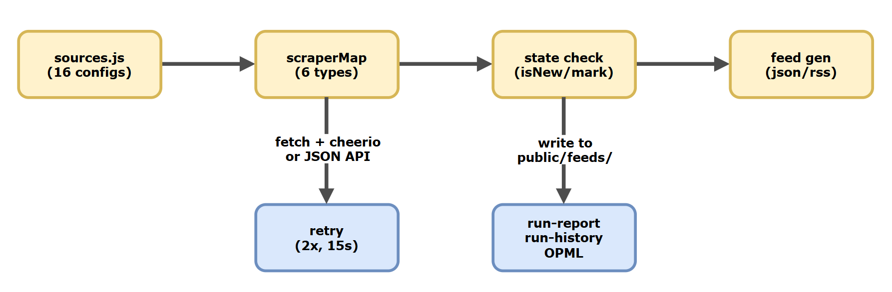

# Architecture

## Overview

anthropic-watch is a Node.js pipeline that scrapes 16 Anthropic-related sources, detects new content, and publishes RSS/JSON feeds to GitHub Pages.



All scraping uses `fetch` + `cheerio` for HTML parsing or direct JSON API calls. There is no browser automation (no Playwright, Puppeteer, or headless Chrome).

---

## Scraper Contract

Every scraper function has the same signature:

- **Input:** a source config object from `sources.js`
- **Output:** `Array<Item>` on success, `[]` on error (errors caught internally)

There is no shared error class. Each scraper wraps its logic in try/catch and returns an empty array on failure. The orchestrator in `index.js` detects implicit failures (0 items when previously had items).

### Scraper Types

| Type               | File                           | API/Method                                        | ID Strategy                                   | Date Strategy                 |
| ------------------ | ------------------------------ | ------------------------------------------------- | --------------------------------------------- | ----------------------------- |
| `github-releases`  | `scrapers/github-releases.js`  | GitHub REST API (`/repos/:owner/:repo/releases`)  | `tag_name`                                    | `published_at`                |
| `github-changelog` | `scrapers/github-changelog.js` | GitHub Contents API (base64 decode)               | SHA-256 hash of file content (first 12 chars) | Current timestamp             |
| `npm-registry`     | `scrapers/npm-registry.js`     | npm registry API (`/latest` + full doc)           | Version string                                | `time[version]` from registry |
| `blog-page`        | `scrapers/blog-page.js`        | fetch HTML + cheerio, with `parseMode` switch     | Post URL                                      | Parsed from page content      |
| `docs-page`        | `scrapers/docs-page.js`        | fetch HTML + cheerio, with `parseMode` switch     | URL or SHA-256 hash                           | Parsed or current timestamp   |
| `status-page`      | `scrapers/status-page.js`      | Statuspage.io REST API (`/api/v2/incidents.json`) | Incident ID                                   | `created_at`                  |

The `blog-page` scraper supports three parse modes: `nextjs-rsc` (Next.js RSC payload extraction with HTML fallback), `webflow` (Webflow CMS classes), and `distill` (Distill.pub TOC layout). The `docs-page` scraper supports `intercom-article` and `docs-hash` modes.

---

## Concurrency

`src/index.js` runs scrapers through `runWithConcurrency(tasks, 4)`:

- Concurrency limit: **4** simultaneous scrapers
- Implementation: a `Set` of in-flight promises; when the set reaches the limit, `Promise.race` waits for one to finish before launching the next
- All results collected via `Promise.allSettled` — one scraper failure does not abort others

---

## State Management

State is stored in `state/last-seen.json` and managed by `src/state.js`.

### State Shape (per source key)

```json
{
  "blog-engineering": {
    "knownIds": ["https://anthropic.com/engineering/post-1", "..."],
    "lastChecked": "2025-01-15T06:00:00.000Z",
    "consecutiveFailures": 0,
    "lastSuccess": "2025-01-15T06:00:00.000Z"
  }
}
```

### State Functions

| Function                      | Purpose                                                           |
| ----------------------------- | ----------------------------------------------------------------- |
| `loadState(path)`             | Read and parse JSON. Returns `{}` if file missing (ENOENT).       |
| `saveState(state, path)`      | Write JSON, creating parent directories if needed.                |
| `isNew(state, key, id)`       | `true` if `id` is not in `knownIds` (or source has no entry yet). |
| `markSeen(state, key, items)` | Add item IDs to `knownIds`, update `lastChecked`.                 |
| `recordSuccess(state, key)`   | Reset `consecutiveFailures` to 0, set `lastSuccess`.              |
| `recordFailure(state, key)`   | Increment `consecutiveFailures`.                                  |

### Failure Detection

The orchestrator detects implicit scraper failures: if a scraper returns 0 items but the source has existing `knownIds` in state, it is treated as an error. First-run sources with 0 items are not flagged. Sources with `consecutiveFailures >= 3` trigger a warning in logs.

---

## State Persistence

State is committed to `main` by the GitHub Actions workflow:

```yaml
git commit -m "chore: update last-seen state"
git push
```

There is no `[skip ci]` tag on the commit message. The commit is a standard push to main.

`loadState` returns `{}` when the file does not exist, so the pipeline works from a clean checkout.

---

## Feed Generation

Feeds use an **accumulation model**: new items are merged with existing feed file contents.

1. Read existing `all.json` → extract its `items` array
2. Merge new items in front of existing items
3. Deduplicate by `${id}|${source}`
4. Sort by `date` descending (nulls last)
5. Slice to limit (100 for all, 50 for per-source)
6. Write JSON and RSS files

The same merge/dedup/sort/slice logic runs for both JSON and RSS generation.

---

## Run Report vs Feeds vs Run History

These three outputs serve different purposes:

| Output                         | Contains                                                  | Use case                          |
| ------------------------------ | --------------------------------------------------------- | --------------------------------- |
| Feed files (`*.json`, `*.xml`) | Items with full content                                   | RSS readers, downstream consumers |
| `run-report.json`              | Per-source status, timing, error messages, summary counts | Dashboard, monitoring             |
| `run-history.json`             | Array of past run summaries with error lists              | Trend analysis, health tracking   |

Items are **not** included in `run-report.json` — they are stripped at write time.

---

## Error Handling

There is no centralized error class (no `ScraperError` or `src/errors.js`). Error handling works at two levels:

1. **Scraper level:** Each scraper wraps its logic in try/catch and returns `[]` on failure.
2. **Orchestrator level:** `index.js` processes `Promise.allSettled` results. Rejected promises and 0-item results (with existing state) are both recorded as errors with messages.

---

## Retry Logic

`src/fetch-with-retry.js` wraps the native `fetch`:

- **Max retries:** 2 (3 total attempts)
- **Backoff:** Linear — 1 second after first failure, 2 seconds after second
- **Timeout:** 15 seconds (via `AbortSignal.timeout`)
- **Retry condition:** 5xx responses and network errors. 4xx responses are **not** retried.
- **User-Agent:** `anthropic-watch/0.4`

Also exports `logGitHubRateLimit(res)` which warns when remaining quota drops below 10.

---

## GitHub Actions

### `scrape.yml` — Scrape and Deploy

- **Triggers:** Daily cron (`0 6 * * *`) + manual `workflow_dispatch`
- **Jobs:**
  1. `test` — checkout, install, `npm test`
  2. `scrape` (needs `test`) — checkout, install, run `node src/cli.js`, write job summary via `src/summary.js`, commit state, deploy to GitHub Pages via `peaceiris/actions-gh-pages@v4`
- **Permissions:** `contents: write`, `pages: write`
- **GITHUB_TOKEN** is passed as an env var for GitHub API calls

### `test.yml` — Test

- **Triggers:** Push to `main`, pull requests to `main`
- **Job:** checkout, install, `npm test`

---

## Testing

Tests use **Vitest** and operate on fixture files rather than live network calls.

- **Fixture injection:** Scrapers accept a `fixtureFile` path via `fetchSource()`. When set, it reads from disk instead of making HTTP requests.
- **Test helpers:**
  - `createTestConfigs(fixturesDir)` — generates configs for all 16 sources pointing to fixture files
  - `createSingleTestConfig(key, path)` — generates a config for one source
- **Fixture capture:** `node test/capture-fixtures.js [source-key]` fetches live data and saves minimized fixtures to `test/fixtures/`
- **Test suites:** Unit tests (`test/unit/`), scraper tests (`test/scrapers/`), E2E pipeline tests (`test/e2e/`)

---

## Dependencies

| Package           | Purpose                                 |
| ----------------- | --------------------------------------- |
| `cheerio`         | HTML parsing for blog and docs scrapers |
| `fast-xml-parser` | RSS and OPML XML generation             |
| `vitest`          | Test runner (dev)                       |
| `yaml`            | YAML parsing in tests (dev)             |
