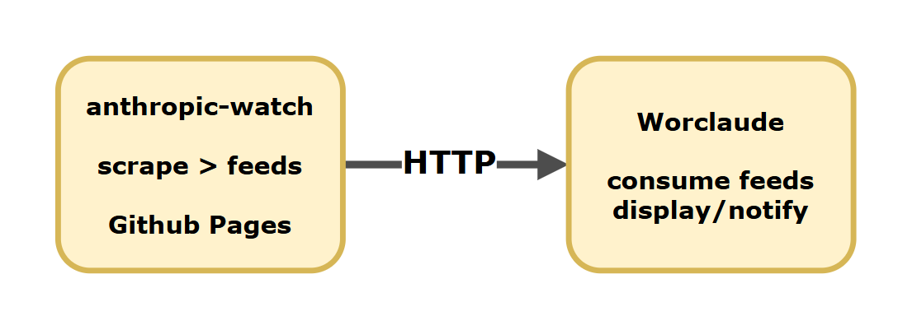

# Worclaude Integration

> **v1.4.0 note:** The feed now includes a third `sourceCategory` value: `community`. Reddit, Hacker News, and GitHub-commits sources (on Anthropic-owned commits-only repos) carry `sourceCategory: "community"`. Worclaude's planned policy: **autonomously act on `core` changes** (create branches, open issues); **treat `community` changes as informational only** (log, surface in dashboards, do not take autonomous action). This is the recommended pattern for any downstream consumer. Update to `@sefaertunc/anthropic-watch-client@1.0.1` for the widened TypeScript type union if your consumer is type-checked.
>
> **v1.3.0 note (retained):** The recommended way to consume these feeds is the `@sefaertunc/anthropic-watch-client` npm package ([packages/client/](../packages/client)). It encapsulates version gating, composite-key deduplication with `uniqueKey` fallback, and typed error handling. Worclaude's own consumer is planned to migrate to the client library in Worclaude v2.6.0.
>
> **v1.2.0 note (retained):** The JSON feed includes a pre-computed `uniqueKey` field (`${id}|${source}`) on every item — consumers should use this directly for deduplication rather than computing the composite key themselves. RSS `guid` is unchanged and will change to the composite form in v2.0.

## Overview

**[Worclaude](https://github.com/sefaertunc/Worclaude)** is a Claude Code-powered workspace assistant that manages development workflows. It is a downstream consumer of anthropic-watch feeds — using them to stay aware of upstream changes to Claude Code, Anthropic APIs, SDKs, and related tooling.

anthropic-watch provides the data layer (scraping Anthropic sources and publishing structured feeds), while Worclaude uses those feeds to power notifications, status checks, and summaries.

## Architecture



```
anthropic-watch (GitHub Actions, daily 06:00 UTC)
  └─ Scrapes Anthropic sources
  └─ Publishes to GitHub Pages
       ├─ run-report.json    ← primary for status
       ├─ all.json           ← primary for items
       ├─ {source}.json      ← per-source items
       └─ run-history.json   ← trend data

Worclaude (scheduled task / on-demand command)
  └─ Fetches feeds over HTTPS
  └─ Processes items and status
  └─ Surfaces relevant changes to user
```

There is no API, webhook, or direct integration — the static feed files on GitHub Pages are the interface.

## Feed Consumption

### What to fetch

| Data needed                           | Fetch from                            | NOT from              |
| ------------------------------------- | ------------------------------------- | --------------------- |
| Items (titles, URLs, dates, snippets) | `all.json` or `{source-key}.json`     | ~~`run-report.json`~~ |
| Source status (ok/error, timing)      | `run-report.json`                     |                       |
| Run history and trends                | `run-history.json`                    |                       |
| Per-source health                     | `run-report.json` → each source entry |                       |

**Important:** Items are **not** included in `run-report.json`. The report contains only status metadata. To get actual items, fetch the feed files.

### Consumption Logic

```js
const BASE = "https://sefaertunc.github.io/anthropic-watch/feeds";

// 1. Get run status
const report = await fetch(`${BASE}/run-report.json`).then((r) => r.json());
const { totalNewItems, sourcesChecked, sourcesWithErrors, healthySources } =
  report.summary;

// 2. Check if this is a new run (avoid reprocessing)
if (report.runId === lastProcessedRunId) return; // already seen
lastProcessedRunId = report.runId;

// 3. Get items from the feed (NOT from the report)
const feed = await fetch(`${BASE}/all.json`).then((r) => r.json());
const recentItems = feed.items.slice(0, 20);

// 4. Per-source status from the report
for (const src of report.sources) {
  if (src.status === "error") {
    console.log(`${src.key}: ERROR — ${src.error}`);
  }
}

// 5. Per-source items (if needed) — separate fetch
const claudeCodeItems = await fetch(`${BASE}/claude-code-releases.json`)
  .then((r) => r.json())
  .then((f) => f.items);
```

### Run Report Source Entry Shape

```json
{
  "key": "claude-code-releases",
  "name": "Claude Code Releases",
  "category": "core",
  "status": "ok",
  "newItemCount": 2,
  "durationMs": 1234,
  "error": null
}
```

Note: `status` is only `"ok"` or `"error"`. There is no `"skipped"` status.

## Impact Mapping

Which anthropic-watch sources are relevant to which Worclaude components:

| Worclaude component   | Relevant sources                                                                                 |
| --------------------- | ------------------------------------------------------------------------------------------------ |
| Claude Code updates   | `claude-code-releases`, `claude-code-changelog`, `npm-claude-code`                               |
| API/SDK changes       | `api-sdk-ts-releases`, `api-sdk-py-releases`, `agent-sdk-ts-changelog`, `agent-sdk-py-changelog` |
| Product announcements | `blog-news`, `blog-engineering`, `blog-claude`                                                   |
| Incident awareness    | `status-page`                                                                                    |
| Research tracking     | `blog-research`, `blog-alignment`, `blog-red-team`                                               |
| Release notes         | `docs-release-notes`, `support-release-notes`                                                    |
| CI/CD tooling         | `claude-code-action`                                                                             |

## Planned Features

- **/upstream-check command:** A Worclaude command that fetches `run-report.json` and displays a formatted summary of source health and recent changes.
- **upstream-watcher agent:** A background agent that periodically checks feeds and alerts on new items matching configurable filters (e.g., only Claude Code releases, or only incidents).

## Reliability Considerations

### Stale reports

Feeds update daily at ~06:00 UTC. If a Worclaude feature needs fresher data, it should display the `timestamp` from the report so users know when data was last refreshed.

### Error handling

Always handle fetch failures gracefully. GitHub Pages can have brief outages. Cache the last successful response and fall back to it when a fetch fails.

### Deduplication

Use the `runId` field from `run-report.json` to avoid reprocessing the same run. Cache the last seen `runId` and skip processing if it hasn't changed.

### Stable URLs

All feed URLs are stable and follow the pattern:

- `https://sefaertunc.github.io/anthropic-watch/feeds/all.json`
- `https://sefaertunc.github.io/anthropic-watch/feeds/{source-key}.json`
- `https://sefaertunc.github.io/anthropic-watch/feeds/run-report.json`
- `https://sefaertunc.github.io/anthropic-watch/feeds/run-history.json`

Source keys are defined in `src/sources.js` and do not change once added.

### Schema versioning

Feed files include `"version": "1.0"`. Worclaude should check this field and handle unknown versions gracefully. See [FEED-SCHEMA.md](./FEED-SCHEMA.md) for the full schema specification.
